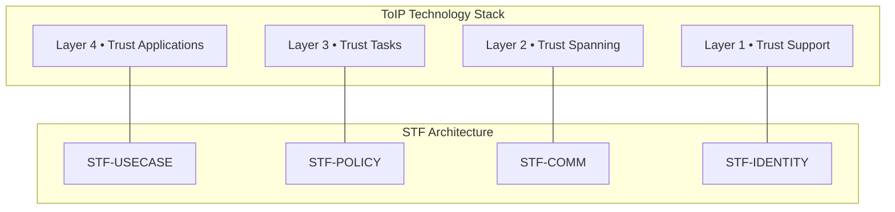

# Sovereign Trust Framework — Architecture

The **Sovereign Trust Framework (STF)** defines a modular, layered architecture for building interoperable, policy-driven trust systems that remain privacy-preserving, transport-agnostic, and governance-neutral.

This document describes the **full STF architecture**, including all components discussed during design, structured into four main layers.  
A final section explains **how STF maps to the Trust Over IP (ToIP) 4-layer architecture** based on the latest information from:  
https://trustoverip.github.io/TechArch

---

# 1. STF Layer Overview

```
+-----------------------------------------------------------+
|                   L4 – STF-USECASE                       |
|      (Use-case logic, domain flows, applied trust)        |
+-----------------------------------------------------------+
|                   L3 – STF-POLICY                         |
|     (VSTP: Verifier-Sovereign Trust Protocol,             |
|      canonicalization, evaluation modules)                |
+-----------------------------------------------------------+
|                   L2 – STF-COMM                          |
|   STF-Message + STF-Transport                             |
|   (VID–cDID mapping, message envelope, transport bridge)   |
+-----------------------------------------------------------+
|                   L1 – STF-IDENTITY                      |
|    (cDID model, key management, DID/VID abstraction)       |
+-----------------------------------------------------------+
```

Each layer is **independent**, **extensible**, and designed for **composable deployment**.

---

# 2. Layer 1 — STF-ID (Identity Abstraction Layer)

Layer 1 provides the **identity substrate** for STF, abstracting DID/VID formats into a unified canonical model.

## Components

### **STF-IDM — Identity Model**  
Core data structures representing:
- **[cDID](STF-IDENTITY/canonicaldid.md)** (canonical DID)  
- **eDID** (ephemeral DID)  
- **VID abstraction** (TSP VIDs or other non-DID identifiers)

### **STF-KMS — Key Management Service**  
Handles:
- key generation  
- local secure storage  
- rotation  
- derivation and export  

Tightly integrated with hardware secure modules (TPM, Secure Enclave, Android Keystore).

### **STF-DDM — DID/VID Derivation & Mapping**  
Responsible for:
- mapping VID → cDID using blind/salted derivation  
- generating fresh ephemeral DIDs  
- resolving identity metadata locally  
- anti-correlation salt strategies  

### **STF-IDX — Identity Index**  
Local privacy-preserving index of known identifiers:
- salted hashes  
- supports lookup by STF-Message and VSTP  
- prevents correlation by third parties  

---

# 3. Layer 2 — STF-COMM (Communication Layer)

Provides a **transport-agnostic communication interface** for all STF-enabled applications.

Two sublayers:

## 3.1. STF-Message

Defines the STF envelope and message-level semantics.

### Responsibilities
- secure VID→cDID resolution  
- envelope construction  
- metadata stripping  
- replay protection and sequencing  
- inner/outer encryption layers  

### Modules
- **STF-MSGE** — Message Envelope Format  
- **STF-META** — Metadata Stripping  
- **STF-CRYPTO** — Cryptographic Adaptors  
- **STF-SYNC** — Ordering & Replay Protection  

Supports:
- DIDComm (via STF-DCB)  
- TSP message subsystem  
- HTTP(S), WebSockets, BLE, NFC, QR  

---

## 3.2. STF-Transport

Abstracts transport protocols into a unified STF transport interface.

### Modules
- **STF-TSPB** — TSP Bridge  
- **STF-DCB** — DIDComm Bridge  
- **STF-HTTPE** — HTTP/WS Adapter  
- **STF-P2P** — Peer-to-Peer Adapters (BLE/NFC)

### Why STF-Transport is needed  
Even with TSP support, STF-Transport:
- normalizes message flows  
- supports fallback transports  
- ensures STF semantics even on transports lacking these guarantees  
- enables DIDComm integration without exposing DID correlation  

---

# 4. Layer 3 — STF-POLICY (Policy, Claims, Attestations, Evaluation)

Layer 3 hosts **VSTP (Verifier-Sovereign Trust Protocol)** and all trust-evaluation components.

```
Claims → Canonicalization → Policy Evaluation → Trust Result
```

## Components

### **STF-VSTP — Verifier-Sovereign Trust Protocol**  
Implements:
- policy-driven evaluation flows  
- request → present → verify → decision  
- sovereign local verification by the verifier  

### **STF-CANON — Canonicalization Module**  
Unifies all claim formats:
- Verifiable Credentials  
- SD-JWT  
- ISO mDocs  
- Attestations  
- Raw claims  
- Derived claims  
into a **single canonical claim graph**.

### **STF-ATT — Attestation Model**  
Defines:
- issuer-driven attestations  
- signatures  
- Sybil resistance  
- trust-weight semantics  

### **STF-CRED — Credential Interpretation Layer**  
Adapters for:
- W3C VC  
- X.509  
- SD-JWT & SD-JWT VC  
- mDocs  

### **STF-POL — Policy Engine (Rego)**  
Implements:
- policy evaluation  
- typed evidence  
- multi-source policy imports  
- deterministic results  

### **STF-REPUTE — Reputation Engine**  
Implements:
- contextual reputation  
- weighted attestation graphs  
- privacy-preserving scoring  
- Sybil resistance  

---

# 5. Layer 4 — STF-USECASE (Application & Domain Logic)

Contains domain-specific logic using STF.

### Components
- **STF-UC-CHAT** — private chat using STF-L2 + VSTP  
- **STF-UC-KYC** — age/identity verification  
- **STF-UC-CONTACT** — trusted contact exchange  
- **STF-UC-TRUSTLIST** — local trust circle management  
- **STF-UC-GOV** — governance overlays (issuer bundles, trust schemas)

---

# 6. Cross-Layer Modules

### **STF-LOG** — Privacy-safe Logging  
### **STF-PRIV** — Privacy Guard  
Enforces:
- no cDID leakage  
- salt regeneration  
- ephemeral-only outward identifiers  

### **STF-STORAGE** — Encrypted Storage  
Stores:
- keys  
- credentials  
- attestations  
- policies  
- transport state  

---

# 7. Complete Architecture Diagram (ASCII)

```
+--------------------------------------------------------------------+
|                         L4 – STF-USECASE                           |
|    UC-CHAT | UC-KYC | UC-CONTACT | UC-TRUSTLIST | UC-GOV           |
+--------------------------------------------------------------------+
|                         L3 – STF-POLICY                            |
|  VSTP | CANON | ATT | CRED | POL | REPUTE                          |
+--------------------------------------------------------------------+
|                         L2 – STF-COMM                              |
|  STF-MSGE | STF-META | STF-CRYPTO | STF-SYNC                       |
|  STF-TSPB | STF-DCB | STF-HTTPE | STF-P2P                          |
+--------------------------------------------------------------------+
|                         L1 – STF-ID                                |
|  IDM | KMS | DDM | IDX                                              |
+--------------------------------------------------------------------+
|                   Local Storage & Privacy Modules                  |
|        LOG | PRIV | STORAGE                                        |
+--------------------------------------------------------------------+
```

---

# 8. STF Mapping to the Trust Over IP (ToIP) Stack

The ToIP stack defines **four technology layers** plus a **governance stack**.  
STF maps cleanly into these layers as follows, based on:  
https://trustoverip.github.io/TechArch

## 8.1. ToIP Layer Overview

| ToIP Layer | Role |
|------------|-------|
| **Layer 1 — Trust Support** | Cryptography, keys, secure storage, identity binding |
| **Layer 2 — Trust Spanning** | Universal interoperable messaging (e.g., TSP) |
| **Layer 3 — Trust Tasks** | Credential exchange, proof presentation, trust decisions |
| **Layer 4 — Trust Applications** | User-facing apps (wallets, KYC, chat, etc.) |
| **Governance Stack** | Rules, registries, trust frameworks, policy governance |

---

## 8.2. STF → ToIP Mapping Table

| STF Layer / Module | Maps to ToIP Layer | Description |
|-------------------|--------------------|-------------|
| **STF-IDENTITY (L1)** | **ToIP Layer 1 — Trust Support** | cDID model, VID abstraction, keys, secure storage |
| **STF-COMM (L2)** | **ToIP Layer 2 — Trust Spanning** | STF-Message + STF-Transport, bridges for TSP and DIDComm |
| **STF-POLICY (L3)** | **ToIP Layer 3 — Trust Tasks** | VSTP, credential evaluation, attestations, reputation |
| **STF-USECASE (L4)** | **ToIP Layer 4 — Trust Applications** | Chat, KYC, contact exchange, trust lists |
| **STF-GOV (future)** | **ToIP Governance Stack** | Issuer bundles, trust schemas, governance rules |

---

## 8.3. Visual Mapping Diagram (Mermaid)



---

# 9. Summary

STF:

- aligns cleanly with the ToIP 4-layer model  
- provides a complete technical foundation for ToIP-based ecosystems  
- is fully transport-agnostic and governance-agnostic  
- supports TSP, DIDComm, and future transports  
- enables policy-driven sovereign trust decisions  
- offers a strong privacy-preserving design  

